<!DOCTYPE html>
<!-- Created by pdf2htmlEX (https://github.com/coolwanglu/pdf2htmlex) -->
<html xmlns="http://www.w3.org/1999/xhtml">
<head>
<meta charset="utf-8"/>

<meta http-equiv="X-UA-Compatible" content="IE=edge,chrome=1"/>
<link rel="stylesheet" href="base.min.css"/>
<link rel="stylesheet" href="fancy.min.css"/>
<link rel="stylesheet" href="main.css"/>

<title></title>
</head>
<body>

Melanoma Skin Cancer Diagnosis based 

on 

Dermoscopic Features 

and 

DNA Mutations

Group No. 45 - Team United

Supervisor: Dr. (Ms.) G. Upeksha Ganegoda

174058F Jayatilake S. M. D. A. C.

174060E Jayaweera J. A. A. M.

174113V Peiris P. D. M.

Outline

• Introduction

• Motivation to Propose a Substitute for the  Existing Clinical Approaches

• Comparison of Other’s Work 

• Aim &amp; Objectives

• Project Approach

• Solution in Detail

• Implementation

• Evaluation

• Conclusion

• Further Work

• Demonstration

Introduction

● Skin cancer is most common among Caucasians and is rapidly increasing year by year. 

● There are three main skin cancer types namely,

■ Basal Cell Carcinoma 

■ Squamous Cell Carcinoma 

■ Melanoma (Superficial Melanoma, Lentigo Maligna, Acral Lentiginous Melanoma, Nodular Melanoma)

● Melanoma is the most dangerous skin cancer type and is the world’s 19

th

 most common cancer.

● Based  on  how  deep  the  Melanoma  tumour  spreads  and  how  high  the  lump  on  the  surface  is,  Melanoma  has  several  stages 

according to its severity. 

● Melanoma  can  occur  due  to  many  reasons.  One  is  when  DNA  is  damaged  from  UV  radiation  burns  on  skin  (causes  somatic 

mutations)

● Most skin cancers can be cured when diagnosed early and therefore it is crucial to diagnose at the initial stage.

● The cost involved in screening cancers by a dermatologist is high and only a dermatologist with a comprehensive knowledge and 

years of practice can detect features of Melanoma from dermoscopic images at a considerable accuracy.

● Genetic or inherited conditions that causes Melanoma cannot be captured by a dermoscopy and sometimes it takes time to show 

features of Melanoma from outside on the skin.

● Therefore two approaches are being considered in this research to detect Melanoma.

■ Extracting the features from a dermoscopic image of a lesion and analysing them

■ Analysing the DNA sequences up to their protein primary structure to identify Melanoma inducing mutations and their types 

in genes

Motivation to Propose a Substitute for the  

Existing Clinical Approaches

Motivation for Diagnosing Melanoma using Dermoscopic Feature Analysis

○ Difficulty in detecting all the relevant dermoscopic features from skin lesions manually.

○ Based on the dermoscopic features identified it is challenging to detect the combinations 

of these salient features that have a higher possibility of being diagnosed with Melanoma.

○ Studies  have  shown  that  a  Dermoscopy  may  even  lower  the  diagnostic  accuracy  when 

being performed by inexperienced dermatologists and therefore a dermoscopy is required 

to be performed by a dermatologist with a load of experience on skin lesions. 

○ Even when an expert dermatologist uses dermoscopy for diagnosis the accuracy level of it 

is estimated to be between 75-84%.

Diagnosing Melanoma using DNA Sequence Analysis

○ Present way of getting a biopsy to detect cancer needs to be taken from the location that is close 

to the symptoms detected area.

○ A  biopsy  takes about  7-10 days  to  get  the  results but  a  DNA  sequence  can  be  taken within  24 

hours and the process of obtaining the samples to test is also simple.

○ When the disease is passed to the offspring genetically, then the mutations could be identified in 

any cell not limiting to just the skin cells.

○ As the molecular structure of the sample taken is extensively checked in a biopsy the cost involved 

is also higher than a genetic test that provides the DNA sequence. But the biopsy results have a 

higher possibility of having more accurate results.

Motivation (cont.)

Comparison of Other’s Work

● Research on Melanoma detection using image processing has been performed mainly giving concern to 

the ABCD features.

● There  are  also  other  research  projects  in  which  they  have  not  specifically  extracted  the  dermoscopic 

features but have performed extensive preprocessing and then used advanced classification algorithms 

on the lesions to diagnose Melanoma. 

● In some research projects the focus is given towards detection of a single dermoscopic feature detection 

so that such features could be used to diagnose different skin diseases. 

● There are other various research as well that were performed to increase the efficiency of the Melanoma 

detection process with  lower resources and  to provide more mobility to the solution such as by using  a 

mobile application through which the images to be analysed are being captured without a dermoscopy.  

In our research the focus is being given towards detecting as many as possible salient dermoscopic features 

in addition to the ABCD features from the lesion so that the accuracy of the diagnosis process will be higher. 

Also  we want to  explore how various  classification approaches work in  this  domain  based  on  the  extracted 

features so that the best approach could be adapted in the Melanoma diagnosis process.  

● Many  researchers have  used  various  alignment  techniques  to  find  mutations  in  genes,  both  wet  and  dry 

sequencing techniques such as pyrosequencing, micoarraying, to Next Generation Sequencing, Needleman-

Wunsch, Smith-Waterman etc. Since in this research we focus on specific genes that affect Melanoma, Smith 

Waterman algorithm is chosen to proceed with.

● There are a few research that focus on finding the similarity of a given DNA sequence using fuzzy concepts. 

Concept papers have included that it is wise to treat the subject’s DNA sequence as a fuzzy sequence while 

considering the reference gene sequence as the crisp sequence. There are almost less/no research work that 

focus on deriving a new sequence with less fragmentation.

● Existing research work also highlights that age plays a prominent role in increasing mutations in genes when 

a  patient  is  becoming  older.  This  fact  is  taken  into  consideration  when  developing  the  algorithm  to 

defragment the entered DNA sequences 

In our research the focus is being given in this module to identify the similarity of the entered DNA sequence 

and to find whether the input is overly fragmented, and if it is, propose a sequence with less fragmentation 

and then go into finding the mutations available. 

Comparison of Other’s Work (cont.)

● In the early development state of DNA/RNA, many researchers have been found models to turn DNA/RNA 

into respective amino acid sequences or primary protein structures. Almost all models are based on the 

three-state context model. The genetic codon table has been developed to convert DNA/RNA to amino acid 

sequences using early studies such as the three-state context model, prediction of protein-coding regions 

using signal processing etc.

● There are few kinds of research about Melanoma detection using protein secondary structure based on 

calculating thermodynamic free energy or called it free energy. But, it is costly in both time and computer 

resources. The reliability issue exists since the secondary protein structures used to calculate free energy are 

predicted from the primary structures.  

● Some research works about vectorising DNA/RNA or amino acid sequences, such as count distribution, pre-

defined specific kernels, sequence embedding using NLP techniques, etc. 

Our  research  focuses  on  Melanoma  detection  based  on  primary  protein  structure  by  designing  and 

developing a supervised learning model that takes the key input as a vectorised amino acid sequence  in an 

efficiently  and  effectively  way  to  overcome  high  time  and  computational  costs  that  exists  in  other’s  work 

related to Melanoma detection. 

Comparison of Other’s Work (cont.)

Research Aim and Objectives

Aim

This research aims to develop a system to identify the risk of being diagnosed from Melanoma by examining the dermoscopic 

images  of  the  skin  lesion using  computer  vision  and  classification techniques or  by analysing  the  mutations  occurred in the 

gene DNA sequences of  a  person  along with  the  changes  in  the  protein primary  structure due  to  the mutation(s)  in  the  DNA 

sequence.

Objectives

● Critically review the literature on the existing skin disease diagnosis approaches that are being used to detect Melanoma.

● Obtain  background  knowledge required in  various  technologies,  techniques  and  methodologies  that  could  be  used  to 

increase the efficiency and the effectiveness of the proposed solution.

● Extract advanced salient features from dermoscopic images and analyse the extracted features to diagnose Melanoma.

● Training a classification model to diagnose Melanoma based on the extracted dermoscopic features. 

● Analyse gene sequences and detect DNA mutations that have occurred along with the type of the mutation.

● Turn mutated DNA sequences into primary protein structures or amino acid sequences included in the mutated gene. 

● Vectorising  amino  acid  sequences  and  building  a  supervised  learning  model  can  identify  Melanoma  and  provide  a 

descriptive  report  by  designing  and  developing  machine  learning  or  neural  network  architectural  solutions  such  as 

Logistic Regression, KNN, LSTM, RNN or CNN.

● Design and develop a prototype that could assist in diagnosing  Melanoma at its initial stages so that proper treatment 

could be started immediately for the patient.

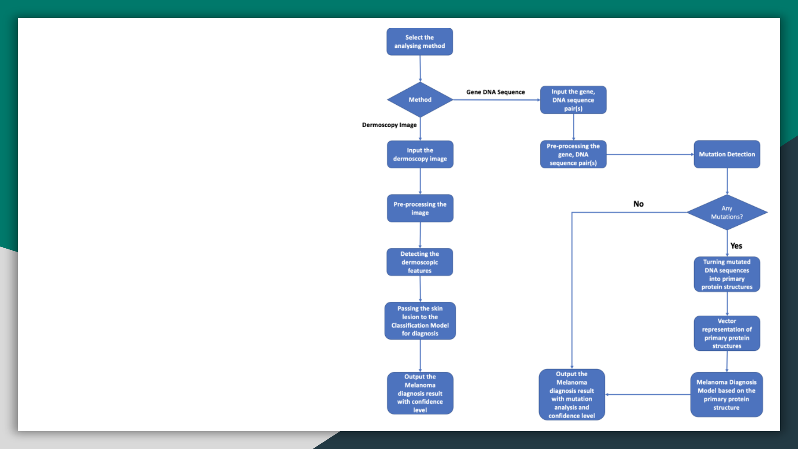
Project Approach

● Two  different  approaches  are  being  used  to 

diagnose  Melanoma  namely  via  dermoscopic 

images and DNA sequences. 

● In  the  first  approach  image  processing 

techniques  are  being  used  to  extract  salient 

dermoscopic  features  when  diagnosing 

Melanoma  using  dermoscopy  images  and  a 

classification model  will  be  trained to  diagnose 

Melanoma using the extracted features. 

● The next approach uses the DNA sequences and 

analyzes its mutations (if any) to determine how 

it  would  be  a  cause  to  be  diagnosed  with 

Melanoma.

● Then  the  mutated  gene  sequence  will  be 

converted  to  its  primary  protein  structure  and 

then transformed to its vector representation. 

● Using  the  mutations  detected  and  the  primary 

protein  structure  as  key  inputs,  the  Melanoma 

diagnosis will be performed.

Project Approach (cont.) 

Output Format of the Melanoma Diagnosis Result 

via DNA Sequence

Output Format of the Melanoma Diagnosis Result 

via Dermoscopic Image

Why use Two Approaches?

● Detecting  the  dermoscopic  features that  exists  in  a  skin  lesion  using  image  processing  techniques  to  diagnose 

Melanoma  is  the  most  common  procedure  followed  clinically  to  detect  Melanoma  and  therefore  that  is  being 

adapted in  this research.

● But in this research the analysis on dermoscopic features is being performed extensively so that no salient feature 

is  being  missed  out  and  therefore  the  combination  of  these  features  could  be  used  optimally  to  diagnose 

Melanoma at a higher accuracy when compared with the existing clinical approach. 

● The major reason to use another approach like analysing the DNA sequence was to detect Melanoma at its earliest 

stages so that it could be treated and cured. 

● In situations where Melanoma is being genetically passed to the offspring or even in other scenarios in which there 

are no dermoscopic features that could be identified at the initial stage.

● But  in  these  scenarios  the  diagnosis  can  be  performed  via  the  DNA  sequence  since  DNA  mutations  could  be 

identified which results in unexpected behavior or inactivity of the protein functionality.

● Still for patients who have found lesions on their skin could use the approach to use the image processing which 

detects the dermoscopic features on the lesion from which the diagnosis is performed. 

● This approach is faster and also cost effective when compared with the DNA analysis while it provides accurate and 

reliable results as well.  

Tech Stack and Datasets Used

Technologies

● Python Language

● Python Libraries

● Flask Framework

● TensorFlow 

Datasets

The following datasets have been found up to now,

● Genomic  profiles  of  ultraviolet-induced  6-4PP  susceptibilities  and  potential  new  roles  in  Melanoma 

development 

● Cancer Browser (COSMIC) 

● Skin Cancer MNIST:10000 Dataset from Kaggle

● Melanoma Detection Datasets from Kaggle

❖ OpenCV ❖ Scikit-learn

❖ Numpy ❖ Scikit-image

❖ SciPy ❖ Pandas

❖ Matplotlib ❖ Keras

Solution in Detail

Module 1: Detection of Melanoma using Dermoscopic Feature Extraction and Analysis

● This  module  will  process  the  dermoscopic  images  and  extract dermoscopic  features that  shows  a  higher 

possibility of being diagnosed with Melanoma.

● Works separately from the other two modules.

● The  images  will  be  pre-processed  using  techniques  such  as  image  enhancements,  noise  removal,  lesion 

segmentation, geometric transformations, etc. before extracting the dermoscopic features to be analyzed.

● Removal of noise  includes removing of  skin hair, ink  patches  and  the lens of  the  dermoscope which causes errors 

when trying to segment the lesion from its background.  

● In addition to the ABCD features, other dermoscopic features such as atypical pigment network, regression structure, 

streaks,  blotches,  globules,  milky-red  areas,  rosettes  and  blue-white  veil  will  be  extracted  in  this  module  of  the 

research. 

● Finally  a  classification approach  will  be  selected based  on  a  evaluation  that  would  work  best  with  the  extracted 

dermoscopic features to diagnose Melanoma with a greater accuracy.

Output

Melanoma 

diagnosis 

result with the 

confidence 

level 

Module 1

Input 

Dermoscopic 

Images

Module 2: Detection of Mutations in Gene DNA Sequences

● This module checks for mutations in the inputted DNA sequence by comparing it with a DNA sequence of 

Non-melanoma subjects. 

● This  module  is  the  starting  point  of  the  process  in  calculating  the  probability  of  being  affected  by 

Melanoma using the DNA sequence and proteins evaluation.

● Most commonly mutated gene that causes Melanoma is CDKN2A germline wise. In this module we hope to 

analyze somatic mutations which are depending on the COSMIC dataset obtained.

● The outputs from this module are passed as inputs to the Module 3.

● This module also includes preprocessing of DNA sequences if the entered sequences are fragmented. It is 

done by a newly developed algorithm that identifies the least mutable nucleotides and reversing them to 

their corresponding reference nucleotide to generate a less fragmented sequence.

Solution in Detail (cont.)

Output

1. Reference gene 

DNA sequence

2. Mutated gene 

DNA sequence 

3. Identified 

mutations and 

positions

Module 2

Input

Gene DNA 

sequence of a 

subject, age

Module 3: Detection of Melanoma based on Protein Primary Structure 

● This  module  aims  to  design  and  develop  supervised  learning  model  architecture  to  classify  Melanoma 

using the key input as primary protein structure.

● This module can be divided into four steps.

1. Translate original and mutated DNA sequences into protein sequences using a three-state context model, 

genetic codon tables, etc.

2. Pre-processing, feature engineering and feature selection based on the COSMIC dataset. 

3. Vector representation of protein primary structure or amino acid sequences.

4. Design and develop generalized supervised learning model to classify Melanoma using machine learning 

or neural network classification algorithms with a reliable accuracy.   

Solution in Detail (cont.)

Output

Melanoma 

diagnosis 

result with the 

confidence 

level 

Module 3

Input

1. Original DNA 

Sequence 

2. Mutated DNA 

Sequence

3. Mutations

Detection of Melanoma using 

Dermoscopic Feature Extraction and 

Analysis 

Module 1 - Implementation

Pre-processing Stages

● There  are  four  main  stages  in  the  pre-processing  phase  which  are  being  performed  in  the  below 

mentioned order.

○ Hair Removal

○ Ink Patch Removal

● Hair, ink patches and lens removal are crucial to be performed at the pre-processing stage as when 

they existed the algorithms were not able to properly perform contour detection which is required to 

segment the lesion from the dermoscopic image.

● The  reason  to  perform  lesion  segmentation  was  to  make  sure  that  all  the  features that  are  being 

extracted are from the skin lesion and not from any noise which might exist in the background of the 

skin lesion.

● When  performing  lesion  segmentation  gaussian  blur,  thresholding  and  morphological 

transformations  such  techniques  were  required  to  obtain  the  most  appropriate  contour  that 

captures the lesion border accurately.

○ Lens Frame Removal

○ Skin Lesion Extraction

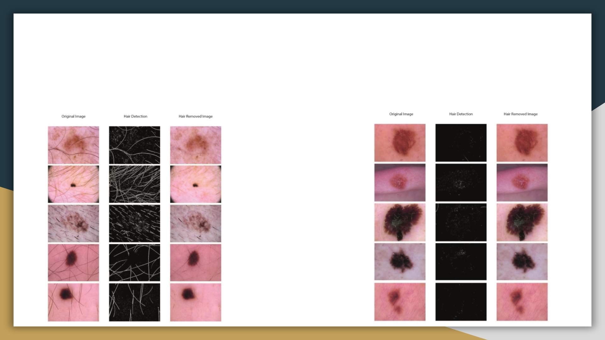
Hair Removal

The importance of performing hair removal in the pre-processing stage is to detect the 

lesion border more accurately.

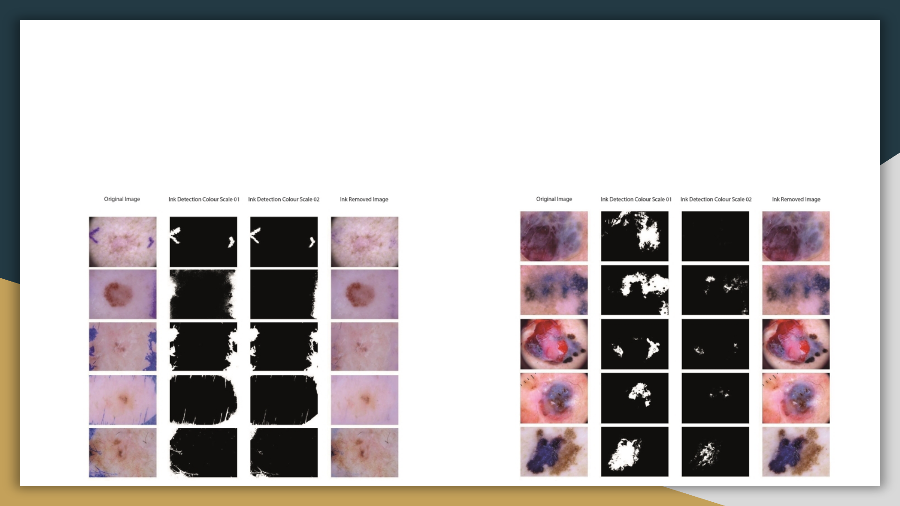
Ink Patches Removal

As  the  colour  features are  being  highly  considered in  the  feature extraction stage,  it  is 

vital to remove the ink patches from the image. It also makes the lesion extraction process 

more accurate.

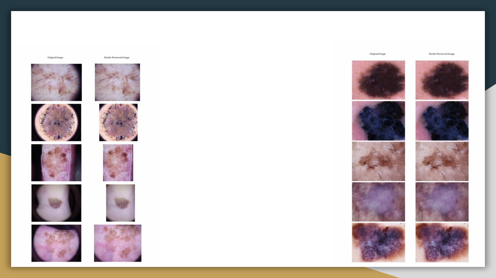
Lens Frame Removal

● In  some  dermoscopic 

images,  the  frame  of  the 

dermoscope  appears  in  the 

image  which  makes  the  skin 

lesion extraction inaccurate. 

● Therefore if the lens frame of 

the  dermoscope  appear  in 

the  image  it  needs  to  be 

cropped so that the effect of 

the  lens  frame  is  minimized 

for  the  lesion  segmentation 

process.

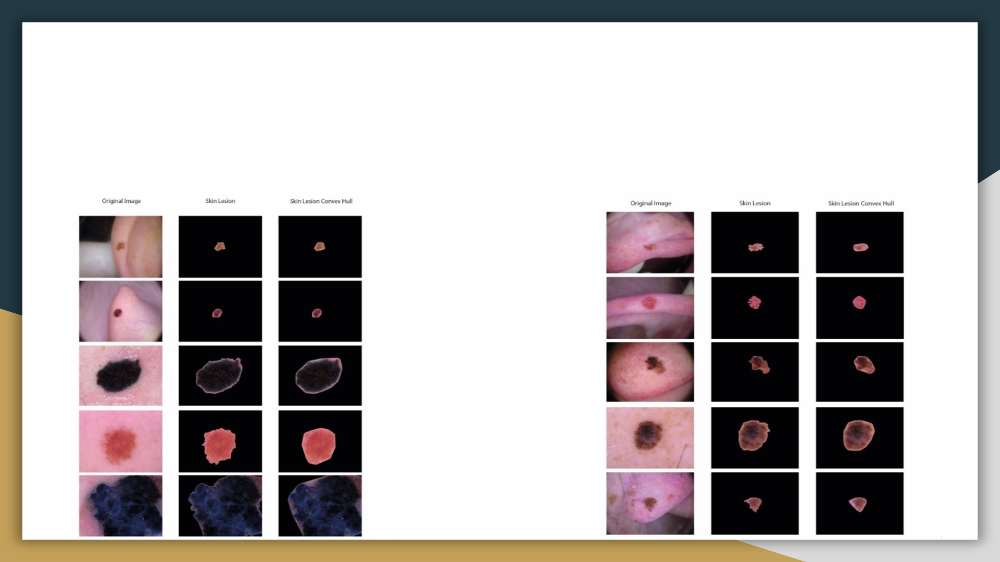
Skin Lesion Extraction

As the background of the dermoscopic image can contain unnecessary noise that would 

affect the accuracy of the feature extraction process, the skin lesion needs to be extracted 

from the image and passed to the feature extraction stage.

Feature Extraction

● There are 12 dermoscopic features that are being extracted in the feature extraction phase.

○ Asymmetry

○ Border Irregularity

○ Colour Variation

○ Diameter

○ Atypical Pigment Network

○ Irregular Streaks

● When giving concern to the number of features to be extracted, if the number of features extracted 

are  minimum  it  will  not  have  enough  information  to  diagnose  Melanoma  and  if  the  number  of 

features extracted is very high it might lead to overfitting as well when using a classifier.

● It had been observed that 5-20 number of features extracted would deliver acceptable classification 

results. Therefore, these  12 features that are being extracted in this stage for classification assist in 

obtaining more accurate and reliable results.  

○ Regression Structure

○ Blue-white Veil

○ Milky-red Areas

○ Globules

○ Blotches

○ Rosettes

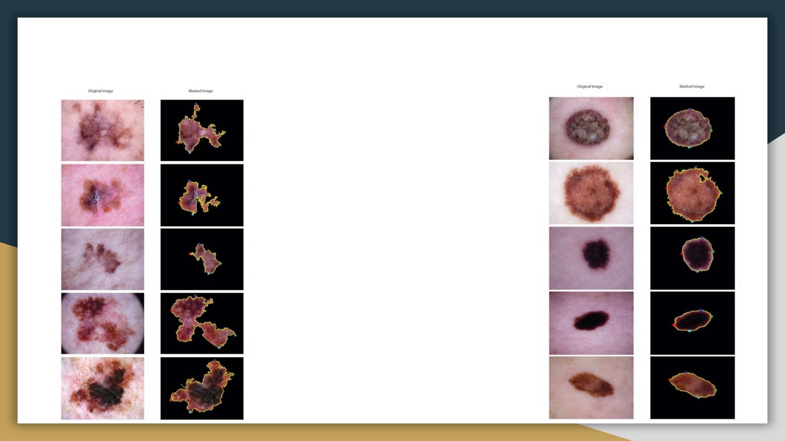
Asymmetry

Asymmetry  means  that  the  skin 

lesion  is  not  symmetric  in  any 

considered  axis.  Therefore  the 

top,  bottom,  left,  right  and 

center  coordinates  were 

obtained  from  which  the 

distance ratios were calculated 

to detect asymmetry of the skin 

lesion. 

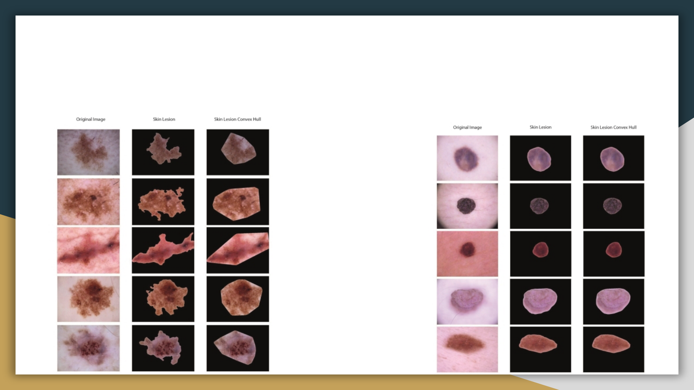
Border Irregularity

Border irregularity is observed when the skin lesion seems to have abrupt endings which are not regular 

and ragged, notched, or blurred borders are visible. 

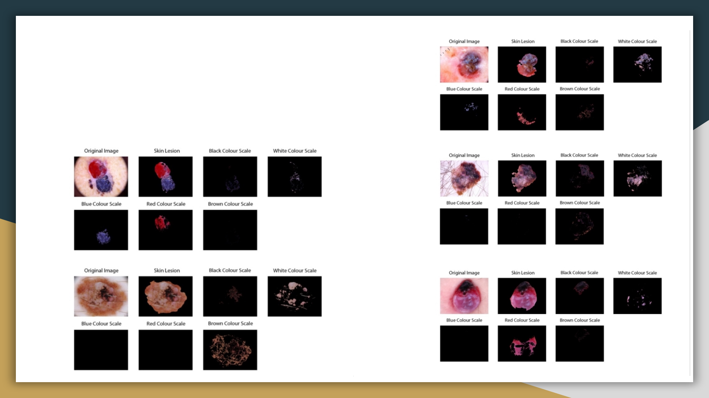
Colour Variation

The  colour  variation  of  a  skin  lesion  can  be  detected 

when multiple colours are observed such as white, brown, 

black, red, and blue. Normally more than two colours can 

be detected in a Melanoma skin lesion.

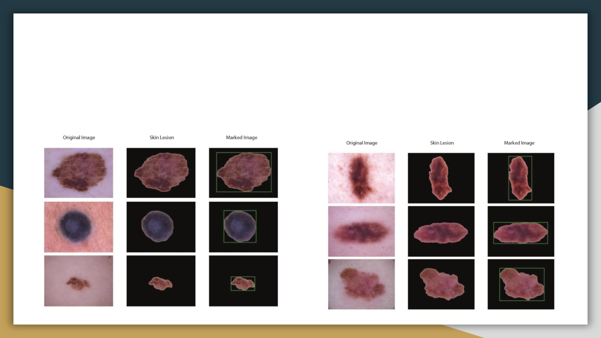
Diameter

The diameter feature is identified when the highest diameter to any considered axis of the area that the 

skin lesion had spread on the surface is greater than 6 millimetres.

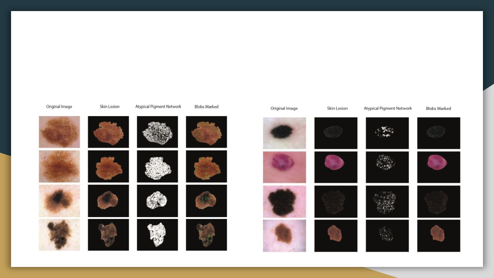
Atypical Pigment Network

Atypical  pigment  networks  are observed when  a  black, brown or  grey asymmetrically  distributed  network 

like structure that spreads on the skin lesion which creates irregular holes and thick lines on the skin lesion.

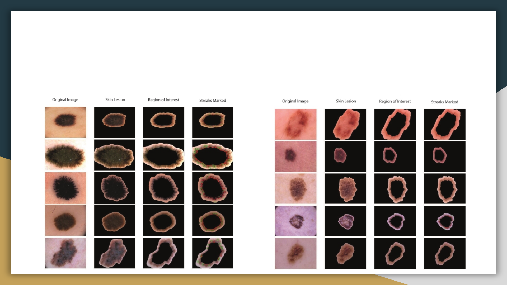
Irregular Streaks

Irregular steaks are identified as Bulbous and finger-like projections that could be seen spread irregularly 

at the edge of the skin lesion that may vary from tan to black in colour. 

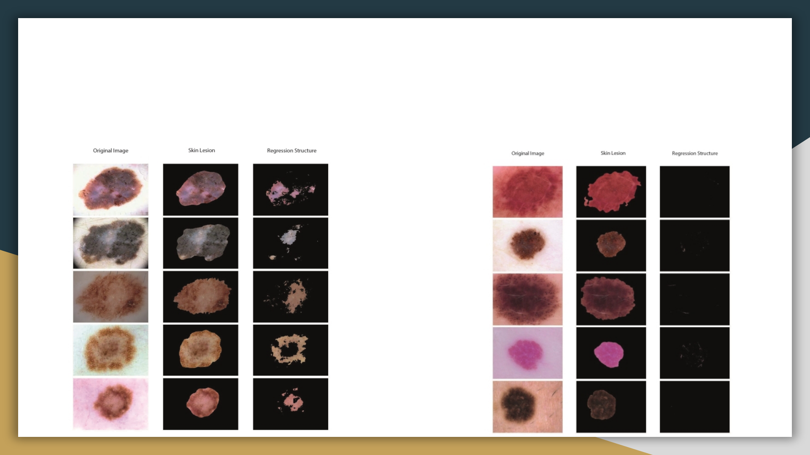
Regression Structure

Regression structures are observed as white scar-like depigmentation on the clinically flat part of the skin 

lesion. In some cases this area may seem with a blue peppering effect as well.

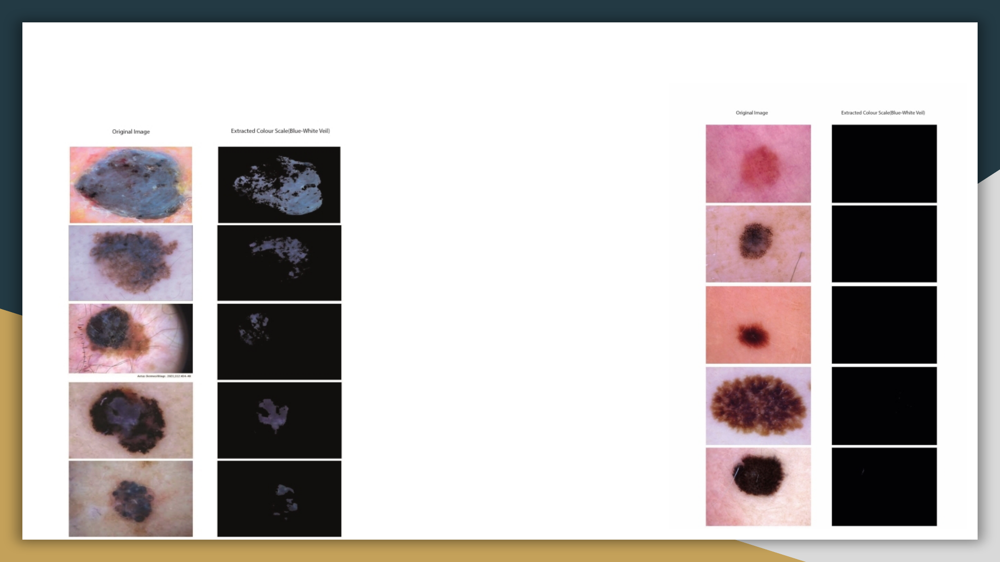
Blue-white Veil

Blue-white  veils  are  irregular 

and  structureless  areas  on 

the clinically elevated part of 

the  skin  lesion  with  a  blue 

pigmentation  and  an 

overlying  white  ground-glass 

like  effect  which  may  even 

result  in  the  colour  of  that 

area appear  to  be  blue-grey 

as  well.  This  is  a  colour 

feature  that  is  being 

extracted from the lesion. 

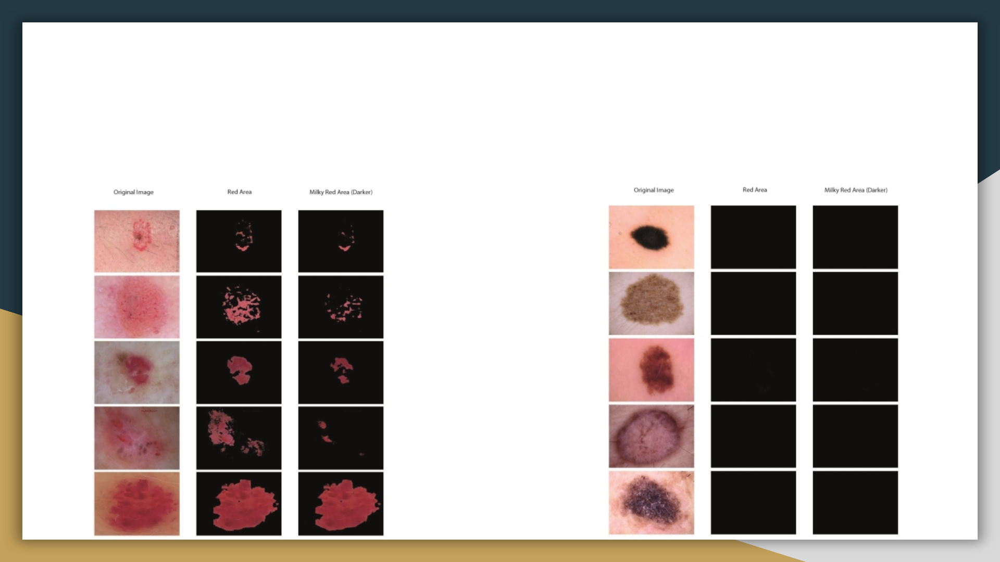
Milky-red Areas

Milky-red areas can be identified as red or pink structureless areas on the skin lesion with a red vascular 

blush on it. Two shades of red needs to be observed when extracting this feature and  therefore this is also 

another colour feature that is being extracted from the skin lesion. 

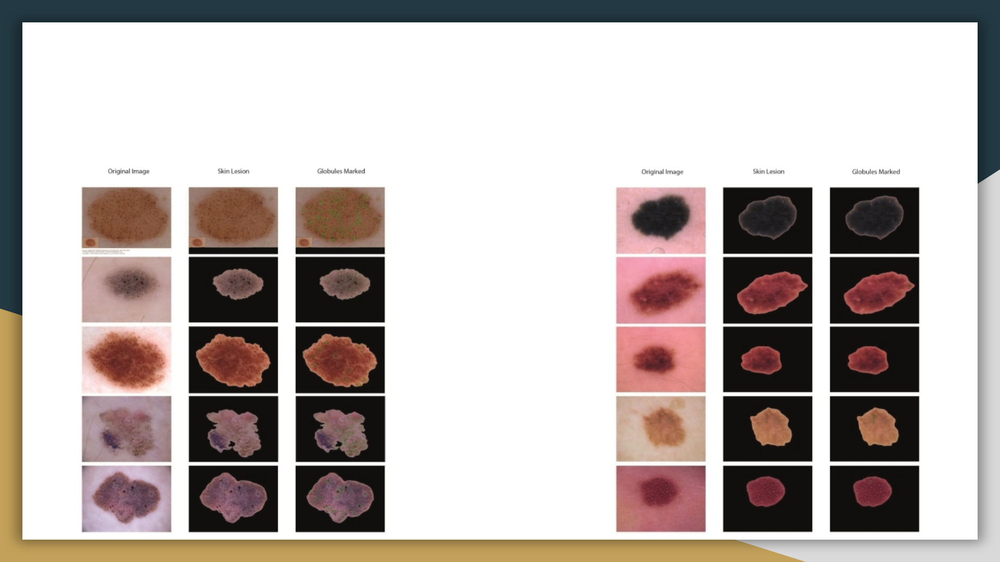
Globules

Globules appear on a skin lesion as black or brown in colour, round to oval in shape and may be in different 

sizes which are being spread irregularly on the skin lesion. 

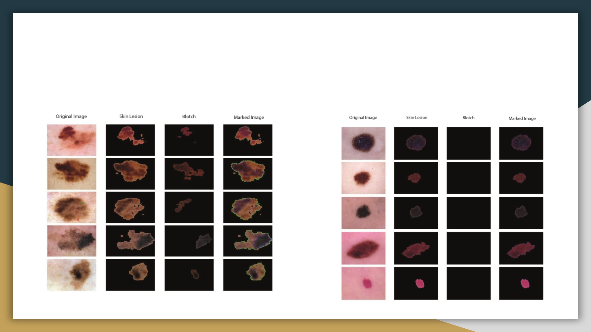
Blotches

Blotches can be detected on a skin lesion as  structureless areas in black, brown or sometimes even grey 

in colour which shows an asymmetric distribution on the skin lesion and ends abruptly.

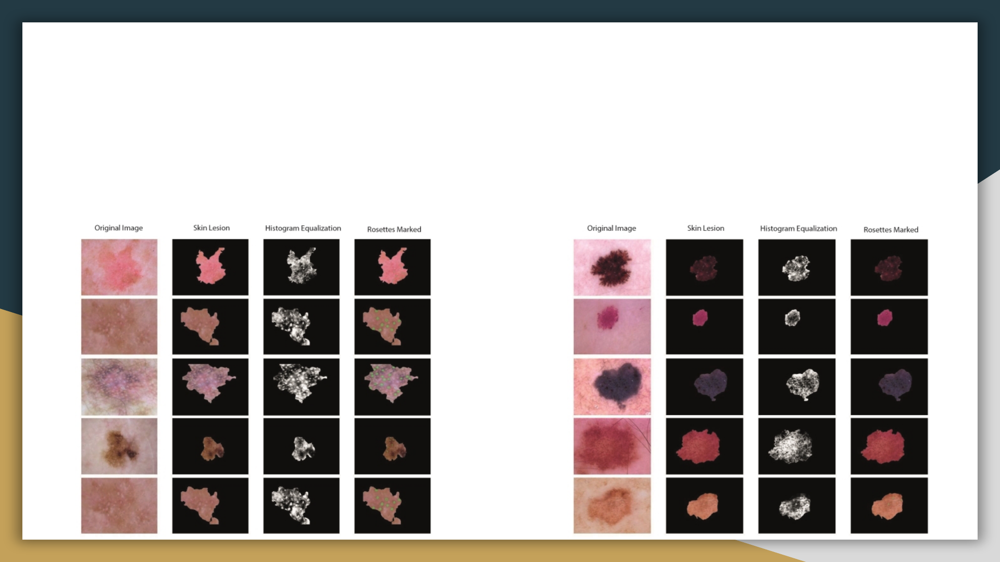
Rosettes

Four white colour dots that are oriented in the same angle and arranged as a square resembling a four-

leaf clover on the skin lesion. When the lesion is captured under polarized light, then rosettes appear more 

clearer on the lesion. 

Classification

● In the classification process there were 8 different classifiers that were evaluated to obtain the best 

suited classifier for the diagnosis of Melanoma based on the obtained feature combinations. These 

classifiers were,

○ Support Vector Machine

○ Decision Trees

○ Logistic Regression

○ K-Nearest Neighbour

● The  Voting-based Ensemble  Method  Classification was  also  evaluated in  this  process  which  was  a 

combination of all the aforementioned classifiers except for the Naive Bayes as it had comparatively 

very poor evaluation results.

● The reason to use these classifiers was due to their extensive applications and the promising results 

delivered in the previous research projects in the considered domain. 

○ Naive Bayes

○ Artificial Neural Networks

○ Adaboost

○ Gradient Boosting

Rest Api Design Documentation

API Endpoint: https://melanoma-detection-tool-api.herokuapp.com/predict-melanoma/dermoscopic-images

Method: POST

Request body format: Form-data

Required keys in request body: image

Example request                                                                                   Example Response 

   { 

         &quot;image&quot; : ISIC_0024554.jpg

    } 

Response Status

200 - Request processed successfully

400 - Bad Request

[

   &quot;Positive&quot;,

   90.53,

   [ 0, 1, 0, 1, 0, 0, 0, 0, 1, 0, 0, 0 ]

]
<a class="l" href="https://melanoma-detection-tool-api.herokuapp.com/predict-melanoma/dermoscopic-images">

</a><a class="l" href="https://melanoma-detection-tool-api.herokuapp.com/predict-melanoma/dermoscopic-images">

</a><a class="l" href="https://melanoma-detection-tool-api.herokuapp.com/predict-melanoma/dermoscopic-images">

</a>

Detection of Mutations in 

Gene DNA Sequences 

Module 2 - Implementation

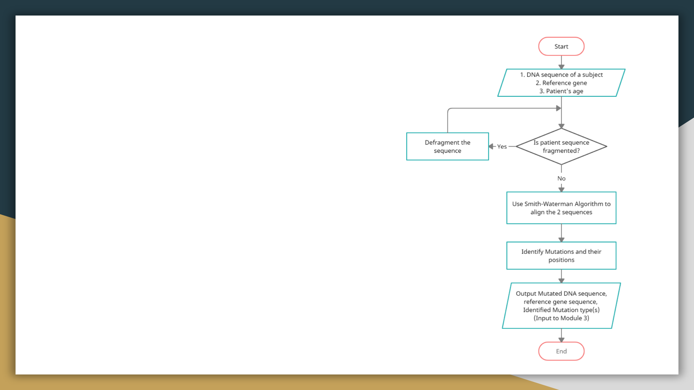
Overview

● The  subject’s  input  DNA  is  checked  for  fragmentation  by 

finding the similarity percentage using fuzzy concepts. 

● If  the  similarity  ratio  is  within  the  similarity  ratio  for  a 

particular  gene,  it  is  passed  on  to  the  Smith-Waterman 

algorithm to detect the mutations.

● Similarity  percentage  threshold  for  a  particular  gene  is 

calculated  by  considering  the  maximum  rate  of  mutations 

allowed per gene, and also the patient’s age (according to lit. 

review)

● The defragmentation is algorithm is then used to defragment 

the sequence, if any.

● When the similarity is within the threshold, the sequences are 

aligned using the local alignment Smith-Waterman algorithm, 

and the mutations are identified. These are passed onto  the 

module 3 as inputs.

Deriving the Maximum Fragmentation 

Threshold

● According to the literature review conducted, the maximum number of mutations that can be present in a healthy and 

young human gene is 2.8 x 10

-7 

 per base pair (Nachman et al, 2000)

● To ease  the  calculation  during  the  implementation,  the  base  pair  calculation  has  been  converted  to  nucleotide 

calculation

● The mutation similarity threshold obtained is .then further improved by taking into account the patient’s age, as the 

age has a prominent effect on the mutation rate of a human gene. (Milholland et al, 2015)

● Using these as parameters, fuzzy logic concepts has been used to derive the mutation fragmentation threshold.

● There were 3 libraries evaluated for the calculation of the mutation threshold and an ensemble of those libraries have 

been used in this module, which is be discussed in evaluation section further

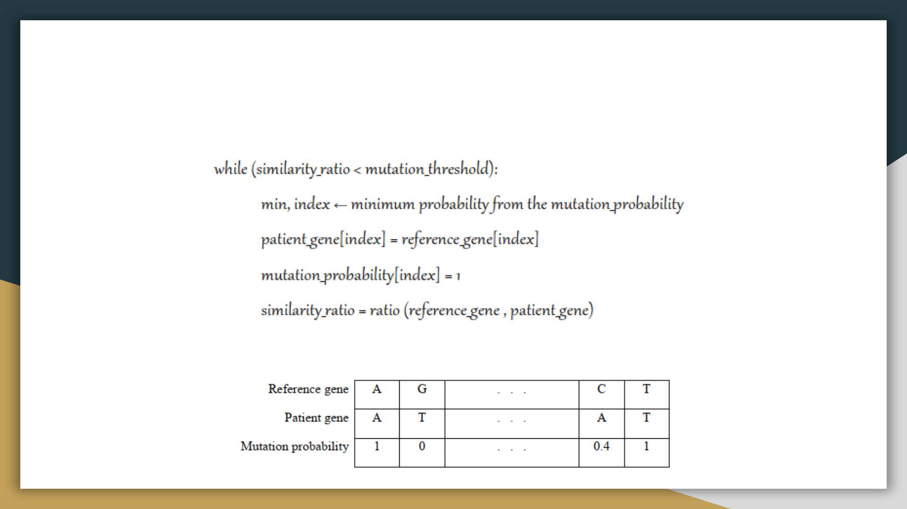
Defragmentation Algorithm

● This newly developed algorithm can be described using the following pseudo code

● The mutation probabilities are derived from the following table

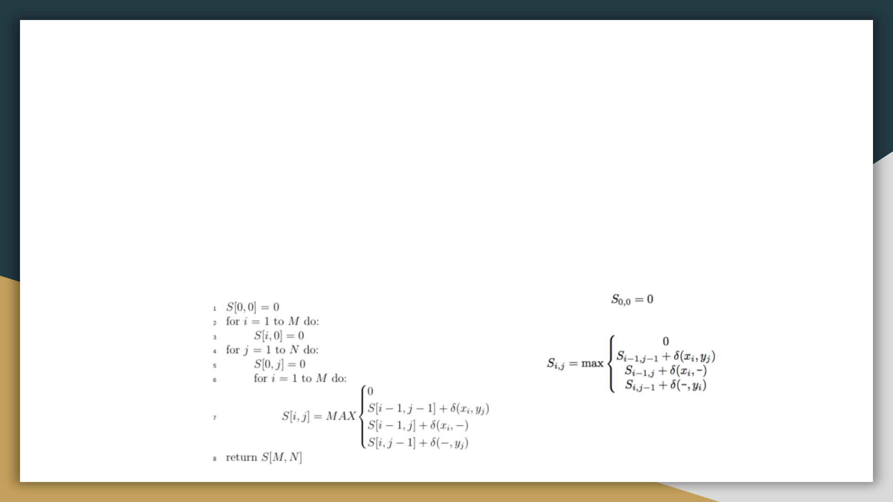
Smith Waterman Algorithm to detect 

Mutations

● After considering  many  mutation  detection algorithms available in the bioinformatics domain,  the Smith Waterman 

algorithm  was  chosen  to  proceed with  as  in  this  research we  focus  on  genes,  which  are  available as  parts  in  the 

human DNA.

● Possible  mutations  that  can  be  identified  include,  insertions,  deletions,  substitutions.  However, in  this  research  we 

focus on substitution mutations to reduce the research complexity

● The algorithm in consisted of three steps including the initialization, matrix fill and the traceback step.

Detection of Melanoma based on Protein 

Primary Structure 

Module 3 - Implementation

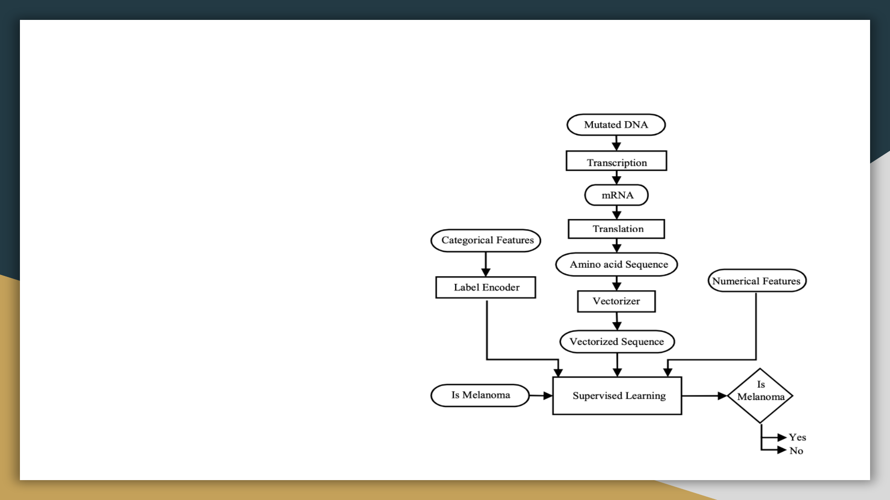
High-Level Architecture Diagram of Proposed Solution 

● As a first step, the mutated DNA sequence 

will  be  passed  through  the  transcription 

and  translation  process  to  retrieve  the 

primary  protein  structure  or  amino  acid 

sequence. 

● Designing  and  developing  efficient  and 

effective  methods  to  represent  protein 

primary  structure  as  numerical 

representation  or  called  vector 

representation. 

● Performing pre-processing, feature engineering  to  select features both  categorical  and 

numerical which supports for melanoma prediction as helper features along with protein 

primary structure.

● Applying relevant label encoding for categorical features.

● Resolving class imbalance.

● Selecting machine  learning or  neural network  algorithms  to  train generalized model  to 

classify melanoma using cross-validation. 

● Optimizing models with randomized grid search to fine-tune hyperparameters for better 

performance in each individual models. 

● Selecting best classifier by evaluating all designed and developed models based on 

precision, recall, f1-score as evaluation criteria. 

High-Level Architecture Diagram of Proposed Solution (cont.)

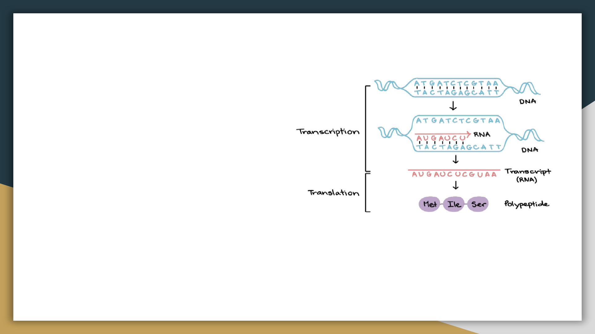
Transcription and Translation Process      

● DNA is made up of a linear string of nucleotides, 

or bases, which are abbreviated as A, T, C, and G 

in their chemical identities. 

● It  includes  making  an  RNA  molecule  by 

duplicating  the  DNA  sequence  of  a  gene.  RNA 

polymerases are enzymes that bind nucleotides 

together  to  generate  an  RNA  strand  (using  a 

DNA  strand  as  a  template).  After  generating 

RNA,  the  amino  acid  sequence  can  be  derived 

from the RNA.

● In  the  translation process,  three-letter codes  in 

DNA/RNA are decoded as one amino acid. That 

is called a codon. 

● AUG is the start codon and UAA, UAG, UGA  are 

the stop codons. 

● So,  the  translation  process  starts  with  the  start 

codon and ends by meeting any stop codon. 

● About  500  amino  acids  are  known  at  present,  but 

only 20 appear in our genetic code. 

Selected Genes and Mutation Types 

❖ Substitution - Missense 

❖ Substitution - Coding Silent 

❖ Substitution - Nonsense

❖ Deletion - In Frame 

❖ Deletion - Frameshift 

❖ Insertion - In Frame 

❖ Insertion - Frameshift 

Mutation Types

Selected Genes

❖ BRAF

❖ MUC16

❖ NRAS

❖ LRP1B

● Substitution is the most frequent mutation type and  insertion and deletion mutations are extremely 

rare.

● Coding Silent has  no  effect on  the  primary  structure of  proteins because the  mutation  in  the  DNA 

codon results in the same real amino-acid.

● Substitution - Missense and Substitution - Nonsense were selected mutation types for the analysis. 

● Genes were selected for the analysis based on the frequency of distribution on COSMIC dataset. 

Vectorizing the Amino Acid Sequence (Protein Primary Structure)

In this module, primarily two types of vectorization approaches for protein 

primary structure representation are designed and developed, as follows:

● Vectorizing Method 01 - Individual Amino-acid Count Distribution

Vectorizing without preserving amino-acids relations

● Vectorizing Method 02 - Pairwise Amino-acid Count Distribution 

Vectorizing with preserving amino-acids relations between each amino-acid 

pair

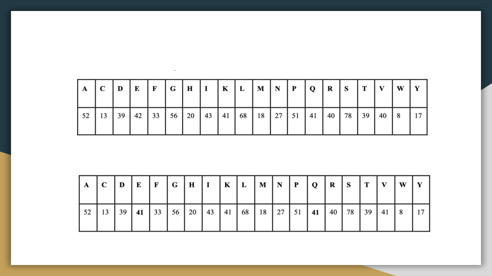
Vectorizing Method 01 - Individual Amino-acid Count Distribution

● Original Amino-Acid Distribution Count of BRAF

● Mutated Amino-Acid Distribution Count of BRAF

Vectorizing Method 01 - Individual Amino-acid Count Distribution 

(cont.) 

● Difference (Changes) of Amino-Acid Distribution Count of BRAF

In this method, 

● There are a total of twenty (20) features accountable to all classification models from 

protein primary structure. 

● Because this method simply considers changes at the protein primary structure level, it 

is simple to learn for all classification models.

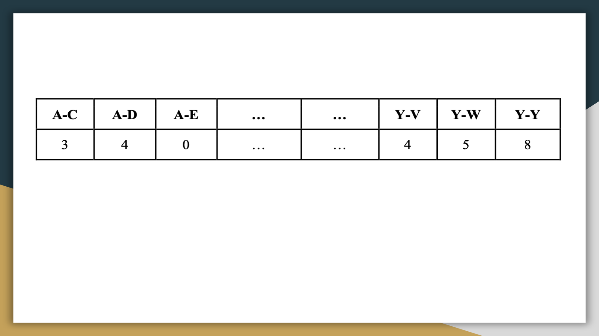
Vectorizing Method 02 - Pairwise Amino-acid Count Distribution

● Example Vector Representation 

In this method, 

● Amino-acid sequence will be read from left to right order. 

● Final vector has a size of 400, resulting in 20 x 20 amino-acids. 

● From the altered DNA, calculates the total number of pairs in the protein primary structure.

● Do not takes only changes as previous method (Vectorization Method 01) . Because, there are 

total four hundred (400) features and it will tend to contains too many zeros in the input buffer. 

This will have an impact on the inability to learn for classification models. 

Reason for Using Count Distribution Vectorizing Technique

Biochemists have discovered that each form of protein includes the same 

amount of total amino acids (often referred to as residues) in the same 

proportion.

As an example,

Insulin = 30 Glycines + 44 Alanies + 5 Tyrosines + 14 Glutamines + ....

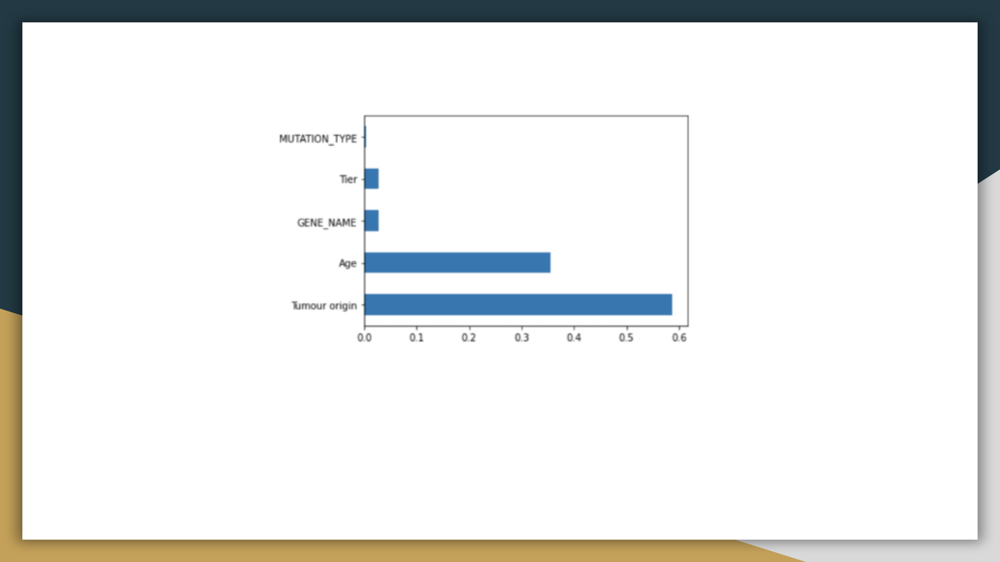
Feature Selection 

● The  entropy-based  calculation  technique  was  used 

which  is  Extra  Decision  Tree Classifier  to  identify  most 

prominent features for melanoma detection. 

● Information  gain  was  the  measurement that  was  taken 

for feature importance when building the Extra Decision 

Tree Classifier.

● Most influential features for melanoma 

detection 

○ Tumor Origin 

○ Age

● Due to the low significance of the feature, 

Mutation Type was rejected.

Handling Class Imbalance

● Total one hundred and twenty four (124) cancer and non-

cancer variations contains the target label. 

● Labeling the target label  

○ Yes (1) - Has Melanoma 

○ No (0) - Not Melanoma

■ This  label contains 123  cancer and  non-cancer 

variations 

● Melanoma cancer accounted for over 23% of data points, 

whereas other 123 cancer types accounted for 77%.

● As a result, the dataset is unbalanced, which may result in 

the model being under-fitted. This problem can be solved 

by  employing  oversampling  techniques,  and  here  it  was 

addressed by employing the following two strategies:

○ Synthetic  Minority  Over-sampling  Technique 

(SMOTE)

○ Adaptive  Synthetic  Over-sampling  Technique 

(ASOTE)

● ASOTE  was  used,  which  is  a  statistical 

technique  for  oversampling  that  creates 

data points rather than duplicating data.

Classification

● In the classification process, there were four machine learning algorithms selected for melanoma 

classification.

○ Logistic Regression

○ Random Forest

○ K-Nearest Neighbors (KNN)

○ Gradient Boosting 

● 35,000+ data points before handling class imbalance 

● 50,000+ data points after handling class imbalance 

● When employing Vectorizing Method 01, a total of twenty-four features (24) were employed to feed the 

models.

● When employing Vectorizing Method 02, a total of four hundred four features (404)  were employed to 

feed the models.

● Randomized search cross- validation (RSCV) was used to discover the optimal hyper parameter for each 

method at random. After that, grid-search cross-validation was used to find the best-generalized model 

for each algorithm using hyper parameter combinations obtained in the RSCV.  

Rest Api Design Documentation

API Endpoint: https://melanoma-detection-tool-api.herokuapp.com/predict-melanoma/pps

Method: POST

Request body format: JSON

Required params in request body: age, gene, tumor, tier, mutated dna

Example request                                                                                   Example Response 

   { 

         &quot;age&quot; : 45, 

         &quot;gene&quot; : &quot;BRAF&quot;,

         &quot;tumor&quot; : &quot;metastasis&quot;,

         &quot;tier&quot; : 1,

         &quot;mutated dna&quot; : &quot;ATGGCGGCGCTG...&quot;

    } 

Response Status

200 - Request processed successfully

400 - Bad Request

{

     &quot;age&quot;: 29,

     &quot;gene&quot;: &quot;BRAF&quot;,

     &quot;pps&quot;: [ 0, 0, 0, 0, 0, 0, 0, -1,

                       0, 0, 0, 0, 0, 0, 0, 0, 0, 0, 1, 0],

     &quot;probability&quot;: 0.8882274916128,

     &quot;tier&quot;: 1,

     &quot;tumor&quot;: &quot;metastasis&quot;

}
<a class="l" href="https://melanoma-detection-tool-api.herokuapp.com/predict-melanoma/pps">

</a>

Code Repos &amp; Application Website

● Melanoma Diagnosis Analysis

○ https://github.com/amesh-jayaweera/melanoma-diagnosis-analysis

● Melanoma Detection API

○ https://github.com/amesh-jayaweera/melanoma-detection-api

● Melanoma Detection Tool 

○ https://github.com/amesh-jayaweera/melanoma-detection-tool

● Melanoma Detection Website 

○ https://melanoma-detection-tool.vercel.app/
<a class="l" href="https://github.com/amesh-jayaweera/melanoma-diagnosis-analysis">

</a><a class="l" href="https://github.com/amesh-jayaweera/melanoma-detection-api">

</a><a class="l" href="https://github.com/amesh-jayaweera/melanoma-detection-tool">

</a><a class="l" href="https://melanoma-detection-tool.vercel.app/">

</a>

Detection of Melanoma using 

Dermoscopic Feature Extraction and 

Analysis 

Module 1 - Evaluation

Results and Evaluation 

● A  balanced dataset  was  used  for  the  evaluation with  equal  amount  of  Melanoma and  Non-melanoma 

skin lesions. These Non-melanoma lesions included different skin diseases so that the model will be able 

to detect Melanoma even among such a scope of skin diseases. 

○ Actinic Keratoses

○ Basal Cell Carcinoma

○ Benign Keratosis

● The best accuracy was obtained with the SVM, LR, ANN, Gradient Boosting, Adaboost classifiers and when 

using  the  voting-based  ensemble  method  in  which  Adaboost  and  Gradient  Boosting  had  the  highest 

accuracy values. 

● Precision, recall and the f-measure are the three other parameters that were used to determine whether 

these accuracy values are reliable and to know which classifier best suits out of the four classifiers that 

had the highest accuracy. 

● With this condition the Adaboost and Gradient Boosting classifiers were not selected as even though their 

accuracy values are high the  other parameters are low which  raises a  question on  the  reliability of  the 

accuracy results they obtained.

○ Melanocytic Nevi

○ Dermatofibroma

○ Vascular Skin Lesions

Results and Evaluation Contd.

Support Vector 

Machine

Accuracy : 90%

Precision : 90%

Recall : 91%

F-measure : 90% 

Accuracy : 91%

Precision : 90%

Recall : 92%

F-measure : 91% 

Logistic 

Regression

Accuracy : 90%

Precision : 93%

Recall : 88%

F-measure : 90% 

K-Nearest 

Neighbour

Artificial Neural 

Network

Accuracy : 91%

Precision : 90%

Recall : 93%

F-measure : 91% 

Accuracy : 93%

Precision : 88%

Recall : 85%

F-measure : 86% 

Gradient 

Boosting

Accuracy : 92%

Precision : 90%

Recall : 92%

F-measure : 91% 

Voting-based 

Ensemble Method

Accuracy : 94%

Precision : 88%

Recall : 87%

F-measure : 87% 

Adaboost

Accuracy : 88%

Precision : 93%

Recall : 83%

F-measure : 88% 

Decision Trees

Accuracy : 88%

Precision : 94%

Recall : 81%

F-measure : 87% 

Naive Bayes

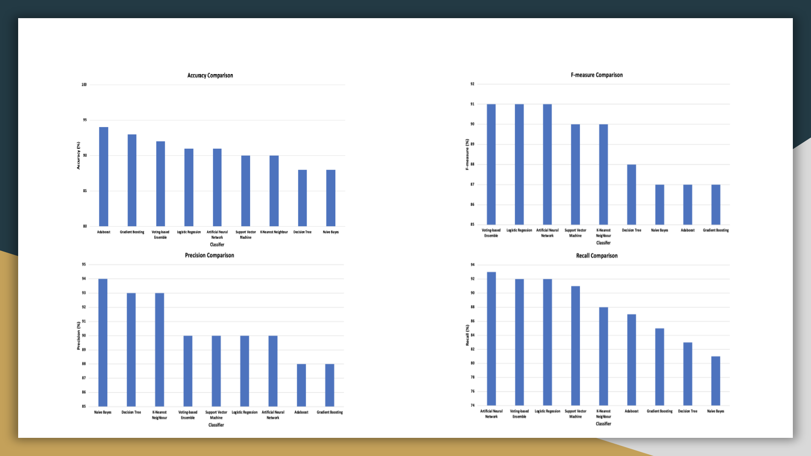
Results and Evaluation Contd. 

Results and Evaluation Contd. 

● When  considering precision, recall and  f-measure along with  the  accuracy, the  best  suited classifier for 

the  Melanoma  diagnosis  process  based  on  the  dermoscopic  features  extracted  is  the  voting-based 

ensemble method as it has overall higher evaluation results. 

● ANN can be identified as the second best suited classier for the purpose where LR and  SVM shows quite 

similar evaluation results which makes them take the third place. 

● The least suited classifiers for the purpose based on the evaluation results were the NB and DT classifiers. 

Therefore these two classifiers were not used in the voting-based ensemble classification method for the 

voting process.

● When comparing the evaluation results obtained using the voting-based ensemble classification with the 

other research projects in the domain, the results were a standout not just as it had better accuracy, but 

also the precision, recall and f-measure values were also high.

● Also as the solution follows the clinical process, it specifically points the dermoscopic features identified 

from the skin lesion and therefore the output also assist dermatologists to get a better idea on the lesion 

and explore the other risks that might occur due to those dermoscopic features. 

Detection of Mutations in 

Gene DNA Sequences 

Module 2 - Evaluation

Evaluation of the Smith Waterman 

Implementation

● To evaluate the efficiency of the algorithm using execution time, several sequences were aligned and mutations were 

found while recording the execution time. 

● it  was  clearly seen that  the  implementation done  using  Python  for  the  Smith  Waterman Algorithm has  more than 

enough efficiency to be used on a clinical application as it has taken less than a second of execution time even for 

sequences with length close 45000 nucleotides

● Algorithm implementation efficiency:

Sequence length No. of Mutations Execution Time (seconds)

8 5 0.505

69 69 0.688

69 0 0.004

570 14 0.036

2301 1 0.531

2301 1 0.028

2301 1735 0.866

2301 42 0.038

43524 1212 0.107

43524 920 0.056

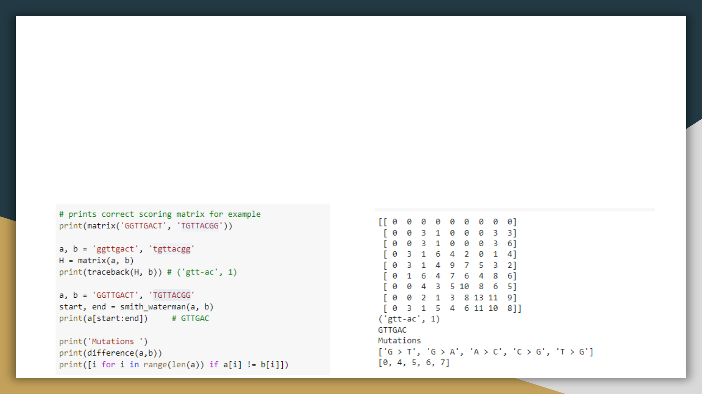
● The accuracy was evaluated by passing a 100% similar sequence and 100% dissimilar sequence to check for how the 

algorithm  behaves at  the  extremes, in  where  the  algorithm  behaved with  100%  accuracy even  after  changing  the 

sequence length. Next, by passing  a  known mutated sequence and  cross-checking the  output,  it  was  clearly seen 

that the algorithm does work as expected.

● Algorithm implementation accuracy

Evaluation of the Smith Waterman 

Implementation (cont.)

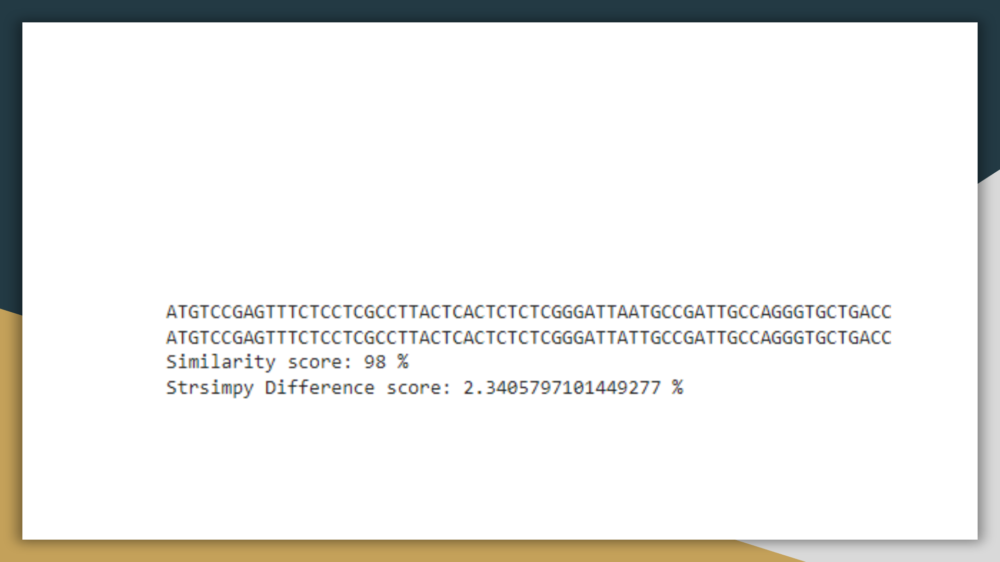
● Three libraries have been evaluated for the calculation of the mutation threshold, so that the derived similarity and 

difference rates vouch for each other’s accuracy. 

○ FuzzyWuzzy with FuzzySearch - calculates similarity

○ Strisimpy - calculates difference

○ Rapid Fuzz -  calculates similarity

● It is observed that this error rate is less than 1% for &gt;98% of the instances and therefore this error rate is accepted 

while conducting this research. 

Evaluation of the Defragmentation Algorithm

● However, it was also  observed that even though the  Strisimpy library generates the  similarity difference, it  takes a 

comparatively large time  to  derive  the  result, making  it  not  suitable to  be  used  as  the  main  similarity  measuring 

library for the whole process of defragmenting.

● When using the RapidFuzz library, it was noted even though it does calculate the similarity rate well, the accuracy is 

more  towards  less  fragmented  sequences  and  it  under  fits  and  overlooks  some  fragmentations  because  of  the 

inaccurate similarity measuring in more fragmented situations.

● Therefore, as  described in  the  implementation section  for  this  module,  an  ensemble of  the  libraries were used  to 

derive the similarity rates of the defragmenting sequence to obtain better results, and that it derives better accuracy 

than using only one library from the beginning to the end of the defragmenting process.

● The algorithm tries its best sure not to over-fit the patient sequence and overwrite the actual mutation(s) by mistake, 

which is done by having threshold values to change the similarity measuring library from one to another. 

Evaluation of the Defragmentation Algorithm 

(cont.)

Detection of Melanoma based on Protein 

Primary Structure 

Module 3 - Evaluation

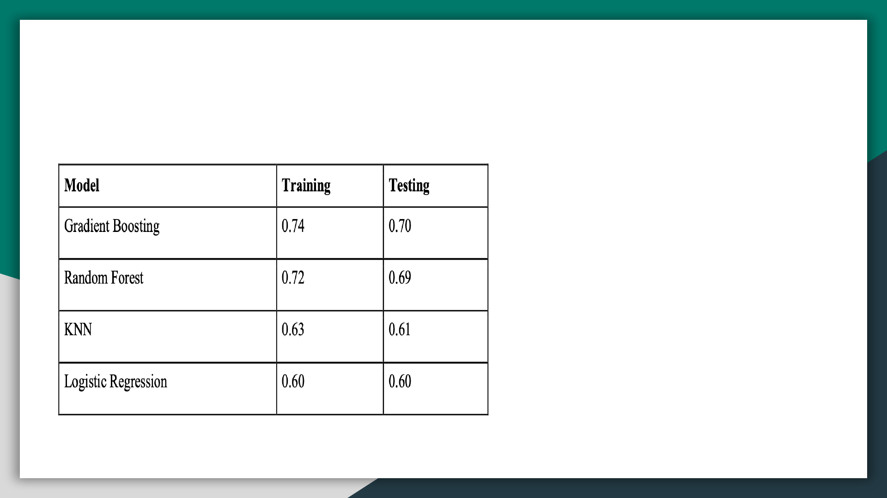
Results and Evaluation - Vectorizing Method 01

● F1-scores for selected classifiers 

● 50,000+ data points 

● 24 features 

● 124 cancer and non-cancer variations 

● Cross-validation 

● Hyperparameter-tuning 

● Best Classifier - Gradient Boosting

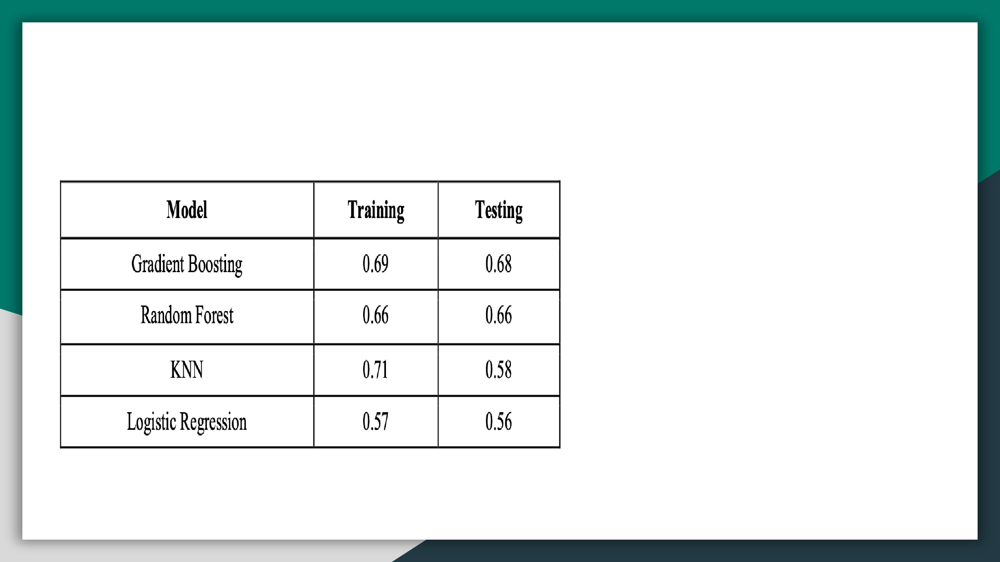
Results and Evaluation - Vectorizing Method 02

● F1-scores for selected classifiers 

● 50,000+ data points 

● 404 features 

● 124 cancer and non-cancer variations 

● Cross-validation 

● Hyperparameter-tuning 

● Best Classifier - Gradient Boosting

Results and Evaluation - Summary 

● The  Gradient Boosting  Classifier model  is  the  best  performer  of  them  all,  with  a  0.70 f1-score  in  the  testing 

phase for Vectorizing Method 01. And it seems all the models are generalized based on the above training &amp; 

testing measures since there is a very slight difference between training and testing f1-score values.

● The  Gradient Boosting  Classifier model  is  the  best  performer  of  them  all,  with  a  0.68 f1-score  in  the  testing 

phase for Vectorizing Method 02.  And  it  seems the KNN model was under- fitted. Because, training achieved 

0.71 f1-score. But,  testing  achieved 0.58 and  it  is  very low compared to  the  value achieved in  the  training. All 

other models except the KNN seem to be generalized.

● Gradient  Boosting  was  the  best  performing  algorithm  for  melanoma  diagnosis  utilizing  genetic  features in 

both vectorizing approaches. 

● Based  on  f1-score  values,  it  appears  that  vectorizing  method  01  is  the  best  methodology  for  representing 

protein primary structure. It also has an advantage in that it only consumes twenty-four features (24) for input 

buffer. 

● Other than protein primary structure, it appears that tumor origin and age are the most influential factors for 

melanoma identification based on entropy-based feature selection.

● Finally, the model was able to detect melanoma patients at the initial stage with overall 0.70 accuracy. 

Conclusion

● This  research  presents  an  efficient  and  accurate  method  of  diagnosing  Melanoma  using  computer  vision  and  DNA 

sequencing.

● When computer vision is being used, unlike other research projects in this research the features are not limited to the ABCD 

features but 12 salient dermoscopic features are being analyzed and extracted to perform the Melanoma diagnosis. 

● With  regard to  the  analysis  of  the  DNA  sequences,  this  research this  research the  mutations  are being  identified even in 

fragmented DNA sequences and also the DNA mutation is being considered up to its protein functionality level to make sure 

that the DNA mutation detected is a cause for Melanoma.

● In both these approaches required pre-processing steps are performed to mitigate the noise before processing and then 

finally the diagnosis is performed using a classification model.

● Voting-based ensemble method classification is  used with  regard to  the  diagnosis  performed based on  the  dermoscopic 

image  and  the  Gradient  Boosting  classifier  is  used  to  build  and  train  the  model  when  diagnosis  is  based  on  the  DNA 

sequence. 

● Accuracy, precision, recall and f-measure values were used to evaluate the obtained results and to compare them with the 

existing research projects in the considered domain. 

● Based on the evaluation results it was visible that the proposal solution in this research is reliable and therefore could be 

used for clinical  practice. It  is capable of  diagnosing  Melanoma at  a  considerable accuracy  in  both  instances  where the 

dermoscopic  features  are  visible  on  the  skin  or  even  when  there  are  no  signs  of  Melanoma  that  enables  diagnosis  of 

Melanoma at its very early stages in which it is curable. 

Further Work

● If datasets could be obtained of patients with both dermoscopic images and DNA sequences, then this diagnosis 

performed separately using two methods can be connected as one and that could increase the accuracy and the 

reliability of the obtained results even better than the already achieved evaluation results. 

● The solution could be further developed to diagnose other types of skin disease as well either by giving concern 

to the dermoscopic image or DNA sequence.

● This  system  could  be  further  developed as  a  mobile  application  which  includes  the  entire  screening  process 

starting  from taking  a  picture of  the  lesions to  the  analysis  of  them  while extracting the  dermoscopic  features 

from them so that the solution. But here the image capturing process needs to be monitored and instructed by 

the application to ensure that the image is captured accordingly. 

● Four genes are targeted to be checked in this research for mutations that can cause Melanoma. This model can 

be further developed to check for mutations in the other genes as well, when the whole DNA sequence of a patient 

is entered into the system. 

● Further analysis could be performed on the Secondary, Tertiary and Quaternary structures of proteins and take 

those structures into consideration when detecting Melanoma to improve the accuracy and recall values of the 

results. 

Demonstration

Thank You

</body>
</html>
